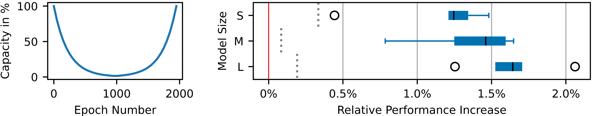

# Cup Curriculum: Curriculum Learning on Model Capacity

This repository presents the code corresponding to the paper [*Cup Curriculum: Curriculum Learning on Model Capacity*](NoLinkBecauseDubbleBlindReviewInProgress).
As highlighted in the paper, the *cup curriculum* is a curriculum learning approach focussing on the model capacity.
The analysis of different variations of the cup curriculum is done in a natural language processing setting.
Our empirical evaluation of these different strategies show that the cup curriculum outperforms early stopping reliably with a median relative performance increase of 1.2% to 1.7% (see Fig.1 right).
In addition to this result, we observe from both the cup curriculum and early stopping a similar resiliance to overfitting.
<figure>
  

    
    <figcaption>Fig.1: (Left) Model capacity throughout training with the cup curriculum. (Right) Relative performance increase of the best performing cup curriculum strategy observed over the best performance of 20 early stopping runs per model size. The red line marks early stopping, the grey line the relative performance increase of the best model found by IMP.</figcaption>
  

</figure>

\
The following gives an overview of the cup curriculum and tries to explain which functions you need to manipulate to adjust my code propperly.
A formal definition of the cup curriculum can be found in the corresponding paper.
The cup curriculum consists of two training phases, one reduces the model capacity via pruning and the other increases it via reintroduction of model capacity.
The first phase of training currently uses a variation of iterative magnitude pruning to reduce model capacity.
The pruned weights are reintroduced in a second phase, resulting in the model capacity to show a cup-shaped curve over the training iterations (see Fig.1 left).

CupCurriculum.py implements the cup curriculum based on the Lottery Ticket Hypothesis [Paper](https://openreview.net/pdf?id=rJl-b3RcF7) and [this](https://pytorch.org/tutorials/beginner/transformer_tutorial.html) transformer tutorial of pytorch.
Main.py is used to execute CupCurriculum.py's main().
Utilities.py defines simple helper functions used for file managment and plots.
Lastly plot_generator.py provides functions for different visualization of the achieved results.
